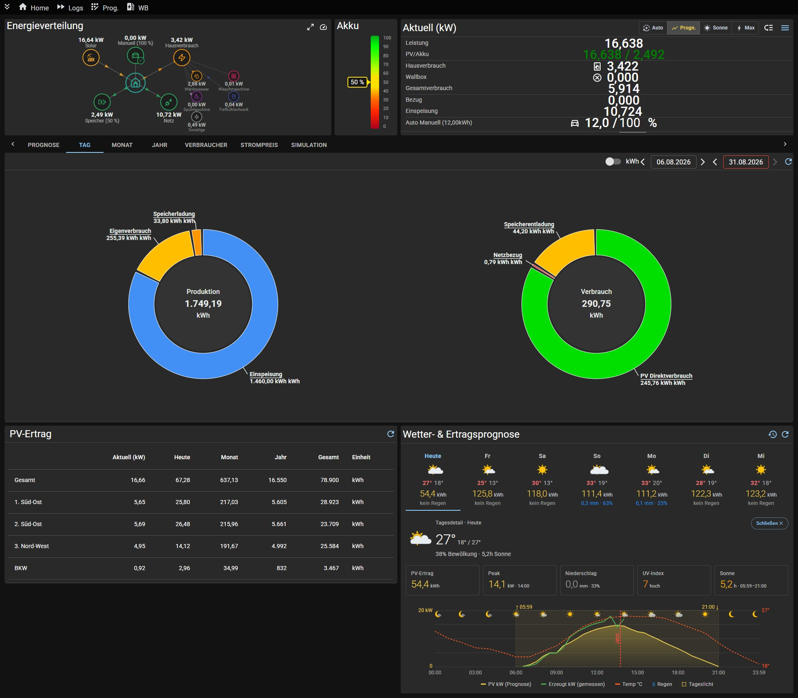
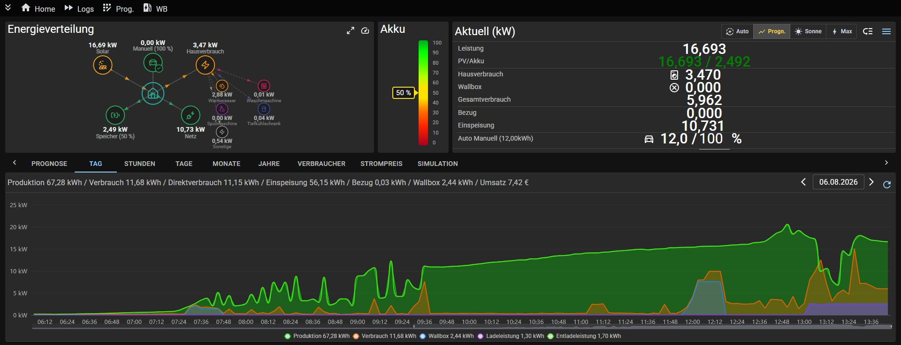
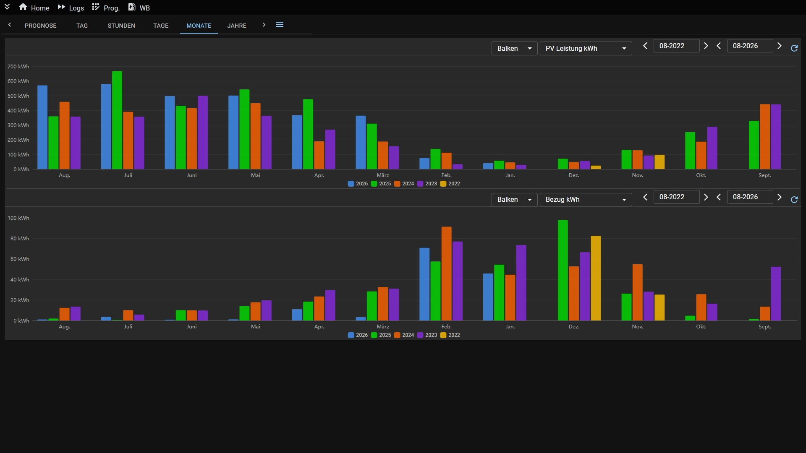
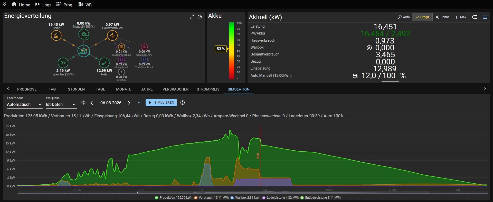
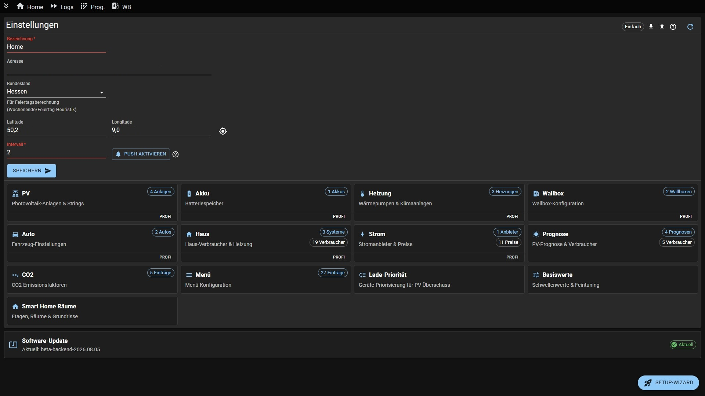

# Solarmanager

Energiemanagementsystem zur intelligenten Steuerung von PV-Anlagen, Wallboxen, Batteriespeichern und Fahrzeugladung.


### Features

| | |
|---|---|
|  | **Dashboard** — Live-Ansicht mit PV-Produktion, Verbrauch, Akku-Status, Wallbox und Wettervorhersage |
|  | **Energieverteilung** — Animierte Darstellung des Energieflusses zwischen Solar, Speicher, Netz, E-Fahrzeug und Hausverbrauch mit Einzelverbrauchern |
|  | **Auswertungen** — Monats- und Jahresvergleiche von PV-Leistung, Bezug, Einspeisung und Verbrauch |
|  | **Simulation** — Ladesimulation mit Prognose: Wie lange dauert die Ladung bei aktuellem Wetter? |
|  | **Einstellungen** — Konfiguration von PV-Anlagen, Akkus, Wallboxen, Autos, Verbrauchern und Prognosen |

---

## Unterstützte Geräte

| Kategorie | Geräte |
|-----------|--------|
| **PV-Wechselrichter** | Huawei (Modbus), Huawei (Fusion Portal), SMA, SunSpec, Shelly |
| **Wallboxen** | go-eCharger, Easee, OCPP 1.6, SunSpec |
| **Batteriespeicher** | Marstek, Huawei |
| **Elektrofahrzeuge** | Tesla, BMW, Hyundai, Kia, VW, Audo, Skoda, Cupra, Mercedes |
| **Smart Home** | Shelly |
| **Heizung** | Heizstab (via Shelly), Buderus KM200 |
| **PV-Prognose** | Solcast, Solarmanager (intern) |
| **Stromanbieter** | Tibber |

---

## Installation & Dokumentation

Die vollständige Installationsanleitung findest du im **[Wiki](https://github.com/BBessler/Solarmanager/wiki)**:

- **[Installation mit Docker (empfohlen)](https://github.com/BBessler/Solarmanager/wiki/Installation-Docker)**
- **[Native Installation (ohne Docker)](https://github.com/BBessler/Solarmanager/wiki/Installation-Nativ)**

### Schnellstart (Docker)

```bash
wget https://raw.githubusercontent.com/BBessler/Solarmanager/main/install/setup_docker.sh
chmod +x setup_docker.sh
./setup_docker.sh
```
