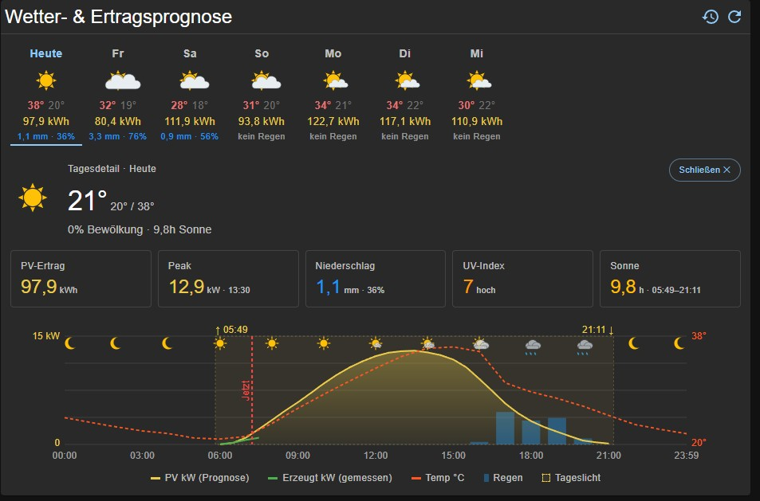
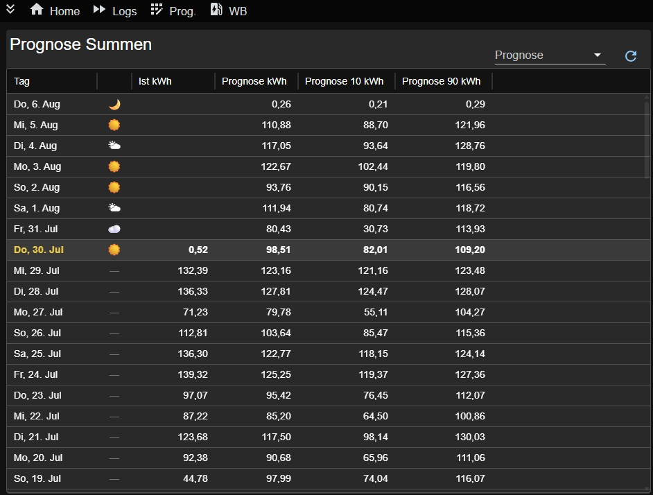
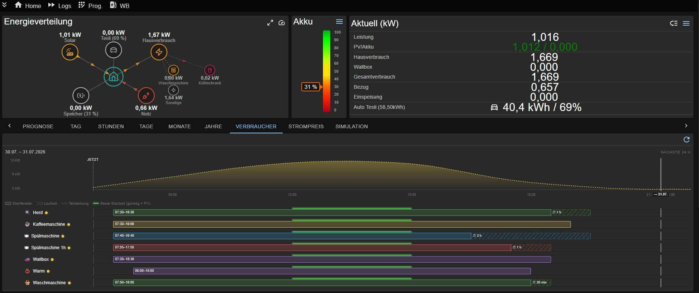
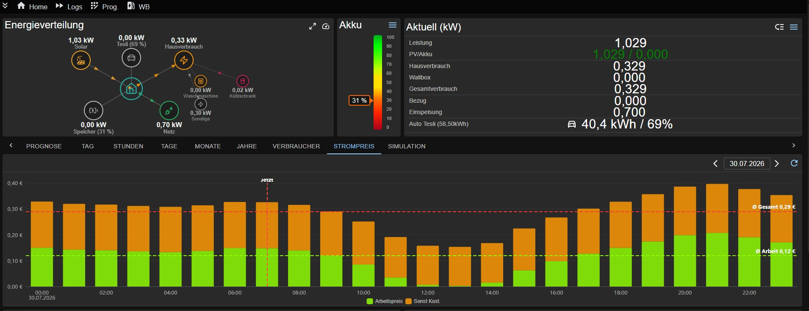
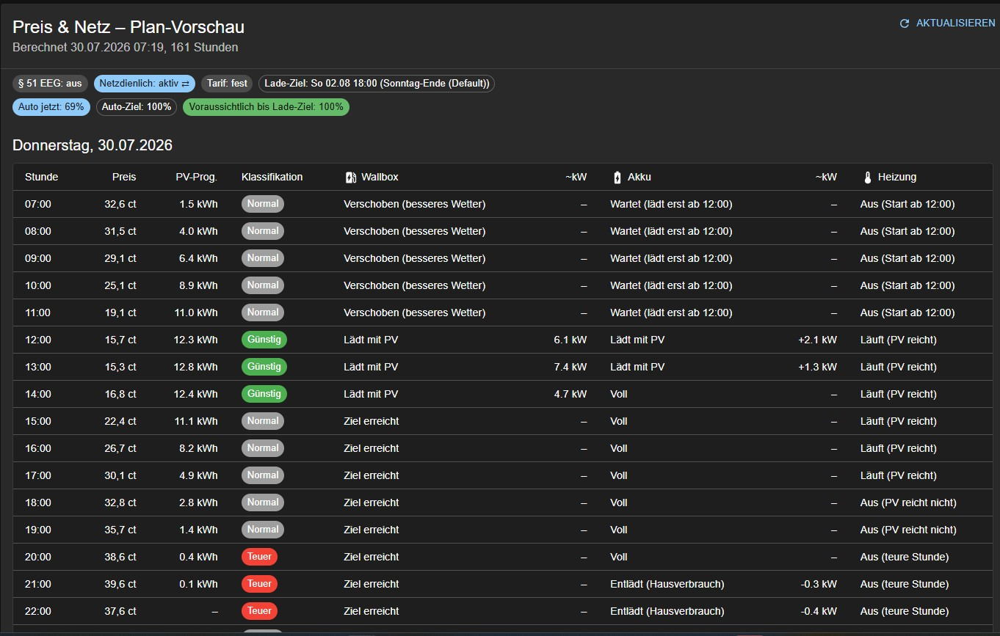
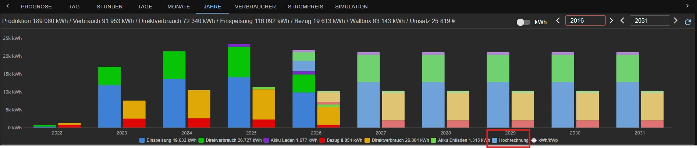
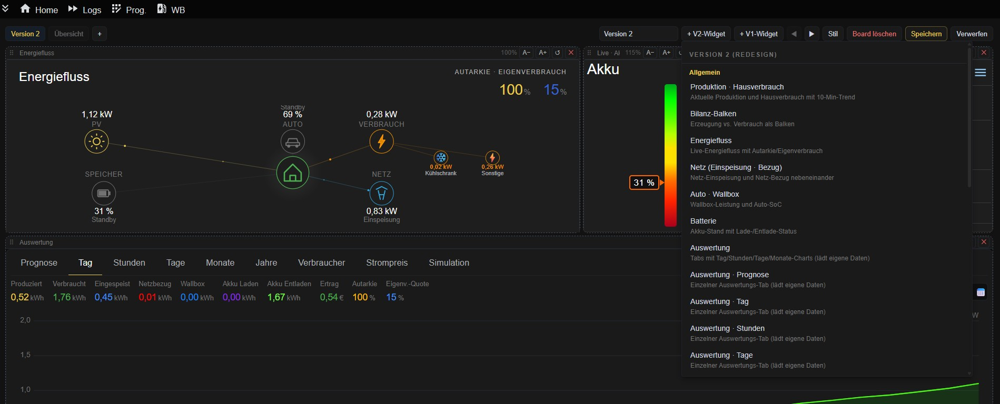
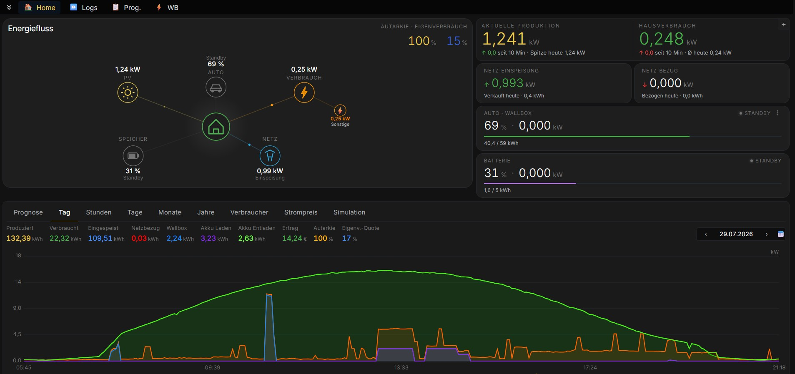

# Solarmanager – PV-Überschussladen & Energiemanagement für dein Zuhause

**E-Auto, Batteriespeicher, Heizstab und Wärmepumpe mit eigenem Solarstrom laden:** Der Solarmanager misst laufend Erzeugung und Verbrauch deiner Photovoltaik-Anlage und verteilt den PV-Überschuss automatisch auf Wallbox, Speicher, Heizung und Smart-Home-Verbraucher. Läuft lokal auf dem Raspberry Pi oder per Docker – ohne Cloud-Zwang, ohne Abogebühren.

🌐 **[solarmanager.online](http://solarmanager.online)** · 📖 **[Installation (Wiki)](https://github.com/BBessler/Solarmanager/wiki)** · 🔌 **[Unterstützte Geräte](http://solarmanager.online/geraete.html)**


### Features

| | |
|---|---|
|  | **Dashboard** — Live-Ansicht mit PV-Produktion, Verbrauch, Akku-Status, Wallbox und Wettervorhersage |
|  | **Energieverteilung** — Animierte Darstellung des Energieflusses zwischen Solar, Speicher, Netz, E-Fahrzeug und Hausverbrauch mit Einzelverbrauchern |
|  | **Auswertungen** — Monats- und Jahresvergleiche von PV-Leistung, Bezug, Einspeisung und Verbrauch |
|  | **Simulation** — Ladesimulation mit Prognose: Wie lange dauert die Ladung bei aktuellem Wetter? |
|  | **Einstellungen** — Konfiguration von PV-Anlagen, Akkus, Wallboxen, Autos, Verbrauchern und Prognosen |
|  | **Wetter- & Ertragsprognose** — 7-Tage-Wetter mit erwartetem PV-Ertrag, Tagesdetail mit Peak, Niederschlag, UV-Index und Sonnenstunden; Prognose-Kurve gegen gemessene Erzeugung |
|  | **PV-Prognose (Summen)** — Tagesübersicht Ist- gegen Prognose-kWh inklusive P10-/P90-Bandbreite zur Bewertung der Prognosegüte |
|  | **Verbraucherprognose** — beste Startzeit für Herd, Kaffeemaschine, Spülmaschine, Waschmaschine & Co. im Startfenster, Laufzeit und Teildeckung entlang der PV-Kurve |
|  | **Strompreise** — stündlicher Verlauf aus Arbeitspreis und sonstigen Kosten mit Ø-Linien und Jetzt-Marker |
|  | **Preis & Netz – Plan-Vorschau** — stündlicher Plan über mehrere Tage: was Wallbox, Akku und Heizung tun, mit Preisklassifikation (günstig/normal/teuer), § 51 EEG und Lade-Ziel |
|  | **Hochrechnung** — Jahresvergleiche inklusive Hochrechnung künftiger Jahre auf Basis der bisher gemessenen Daten |
|  | **Eigene Dashboards (Boards)** — Widget-Katalog, Drag & Drop, Größen- und Stil-Anpassung pro Widget |
|  | **Alternatives Dashboard-Design** — kompakte Kachel-Ansicht mit Energiefluss, Live-Kennzahlen und Tagesverlauf in einem Bild |

---

## Funktionen

- **PV-Steuerung & Eigenverbrauch** — automatische Verteilung des PV-Überschusses auf Akku, Wallbox, Heizung und Smart-Home-Verbraucher; konfigurierbare Lade-Prioritäten
- **Wallbox-Steuerung** — Lademodi Verbrauch / Sonne / Sonne (max) / Prognose, automatischer Phasenwechsel, Auto-Kalender mit Abfahrts- und Ankunftszeit (Anwesenheitsfenster) und Ladelimit
- **Akku-Steuerung** — Lade-/Entlade-Optimierung, Notladung, Hold/Sperren-Steuerung für gängige Hybrid-Modelle; optionale Akku-Entladung für Heizstab/Warmwasser und Wallbox mit automatischer, am Nachtverbrauch orientierter SoC-Untergrenze
- **Heizungs-Steuerung** — Wärmepumpen, Heizstäbe und Klimaanlagen über PV-Überschuss, mit Heizungsunterstützung und WW-Komfort-Logik
- **PV-Prognose & Wettervorhersage** — eigene ML-Prognose oder externer Anbieter (Mischmodus mit Fallback)
- **Verbraucherprognose** — Großverbraucher (Waschmaschine, Spülmaschine, …) in den passenden PV-Zeitraum legen
- **Preisbasierte Steuerung** — dynamische Tarife (Tibber, aWATTar), § 51 EEG-Nullvergütung, Netzdienliches Laden mit 7-Tage-Plan-Vorschau
- **Smart Home** — Shelly-Geräte, MQTT, Räume/Etagen mit Grundrissen, Szenen
- **Statistik & Auswertung** — Tages-/Monats-/Jahresvergleiche, kWh und Kosten pro Verbraucher, CO2-Bilanz, Auto-Reichweite & Kosten/100 km
- **Individuelle Dashboards (Boards)** — frei konfigurierbare Widget-Boards mit Drag & Drop, eigenem Stil-Editor und geräteübergreifender Synchronisation
- **Simulation (Ladetag)** — interaktive Simulation eines kompletten Ladetags
- **Push-Benachrichtigungen** — Web Push bei PV-Ausfall, Wallbox-Fehler, Auto fertig, Speicher voll
- **Setup-Wizard** — geführte Ersteinrichtung

---

## Unterstützte Geräte & Schnittstellen

| Kategorie | Hersteller / Protokoll |
|-----------|------------------------|
| **PV-Wechselrichter** | Huawei (Modbus / FusionSolar), SMA, SunSpec, Fronius, Kostal Plenticore, GoodWe, SolarEdge, Growatt, LG ESS Home, Shelly (BKW), Solaranzeige |
| **Wallboxen** | go-eCharger, Easee, OCPP 1.6/2.0, SunSpec (Modbus), Keba, Fronius Wattpilot, Mennekes, Webasto, Hardy Barth, Heidelberg, Elli Charger 2 (baugleich ID. Charger 2, Škoda Charger, CUPRA Charger 2) |
| **Batteriespeicher** | Marstek, Huawei, SMA, SunSpec (Modell 124), LG ESS, Ecoflow |
| **Elektrofahrzeuge** | Tesla, BMW, Hyundai, Kia, Mercedes, Opel, Peugeot, Citroën, DS, Renault, Manuell |
| **Smart Home** | Shelly (Schalter, Dimmer, Energiezähler, Thermostat), MQTT |
| **Heizung / Wärmepumpe** | Heizstab (via Shelly), Buderus KM200, LG ThinQ Connect (Therma V), Vaillant, Splitklima, Gas-Heizung |
| **PV-Prognose** | Solcast, Solarmanager-intern (ML.NET) |
| **Stromanbieter** | Tibber, aWATTar (Spotpreis-Fallback ohne Login) |
| **Wetter** | Open-Meteo |

---

## Installation & Dokumentation

Die vollständige Installationsanleitung findest du im **[Wiki](https://github.com/BBessler/Solarmanager/wiki)**:

- **[Installation mit Docker (empfohlen)](https://github.com/BBessler/Solarmanager/wiki/Installation-Docker)**
- **[Native Installation (ohne Docker)](https://github.com/BBessler/Solarmanager/wiki/Installation-Nativ)**

### Schnellstart (Docker)

```bash
wget https://raw.githubusercontent.com/BBessler/Solarmanager/main/install/setup_docker.sh
chmod +x setup_docker.sh
./setup_docker.sh
```
